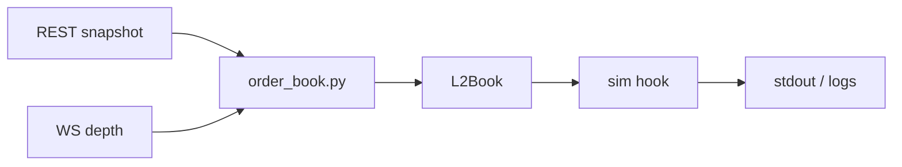
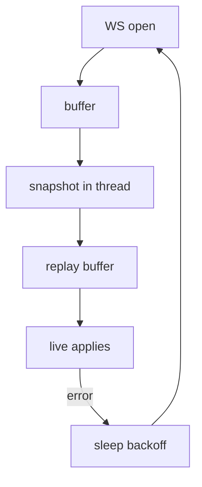

# Binance depth + toy simulator

Not a trading bot: public Binance Spot depth only. Pulls a snapshot, streams diffs, keeps a local book. Optional sim: OBI-ish score, fake quotes, fake fills when quotes cross the touch.

## What runs where

- `order_book.py` – websocket + REST sync, prints best bid/ask
- `l2_sim/l2_book.py` – bid/ask levels in memory
- `l2_sim/obi.py` – imbalance from top K levels each side
- `l2_sim/quoting.py` – fake bid/ask prices
- `l2_sim/execution.py` – fake fills (crossing rule)
- `l2_sim/inventory.py` – fake position + rough adverse counter
- `l2_sim/simulation.py` – hooks sim after each depth apply
- `main.py` – CLI: `live` or `quote` (+ flags)

## Output

Feed (`python order_book.py`):

`ID … | Bid … | Ask … | Spread …`

Sim logs (`python main.py quote`):

`mid`, `obi`, `inv`, `adverse`, `total_fills` (since start), `tick_fills` (this tick), `bb`/`ba` (book touch), `q_bid`/`q_ask` (fake quotes).

Fills only if quotes cross: buy when `q_bid >= ba`, sell when `q_ask <= bb`.

Quote modes (`main.py quote`, default `cross`):

- `cross` – bid/ask built off spread so they can cross (fills show up)
- `sym` – mid ± `half_spread`; if `half_spread` is huge vs real spread, fills stay 0

## Install

```bash
pip install -e .
```

## Commands

```bash
python order_book.py          # book only (symbol = DEFAULT_SYMBOL in order_book.py)
python main.py live --symbol SOLUSDT
python main.py quote --symbol SOLUSDT
python main.py quote --symbol SOLUSDT --quote-mode sym --half-spread 0.01
python main.py quote --symbol SOLUSDT --quote-mode cross --cross-k 0.51
python main.py quote --symbol SOLUSDT --log-file lob.log --debug
```

`main.py` flags: `--symbol`, `--quote-mode`, `--cross-k`, `--half-spread`, `--quote-size`, `--obi-depth`, `--inventory-gamma`, `--log-file`, `--debug` (logging runs for `quote`, or for `live` when `--log-file` / `--debug` is set).

Uncomment at bottom of `order_book.py` for REST-only: `ping_depth`, `test_fetch_snapshot`.

## Diagrams





## Links

- https://developers.binance.com/docs/binance-spot-api-docs/web-socket-streams#how-to-manage-a-local-order-book-correctly
- https://developers.binance.com/docs/binance-spot-api-docs/rest-api/market-data-endpoints#order-book
- https://developers.binance.com/docs/binance-spot-api-docs/web-socket-streams#partial-book-depth-streams

## Cloud

No deploy scripts here. Run the same Python on a VM near the exchange if you care about latency; use a process supervisor and a log file.
