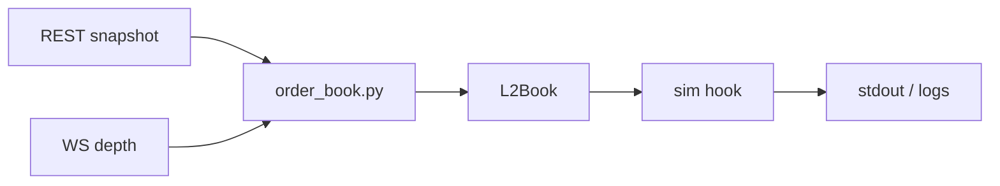
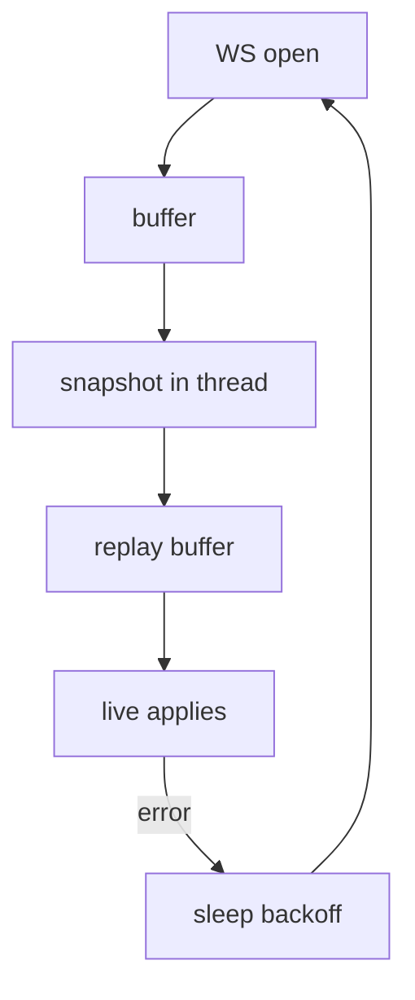

# Binance depth + toy simulator

Public Binance Spot depth only: REST snapshot + websocket diffs → local L2 book. Optional toy sim (OBI, fake quotes, virtual fills when quotes cross the touch). Not a trading bot; nothing is sent to the exchange.

## Install

```bash
cd /path/to/L2-Order-Book-Quoting-Siumulator
pip install -e .
```

## Quick commands

Pin your own fake **buy** (bid), **sell** (ask), or **both** with `--bid-price` / `--ask-price` (each optional; **`quote`** or **`tui`**). Omit a side = no quote on that side.

| Goal | Command |
|------|---------|
| Book only (symbol = `DEFAULT_SYMBOL` in `order_book.py`) | `python order_book.py` |
| Live best bid/ask stream | `python main.py live --symbol SOLUSDT` |
| Same as above (`live` is the default subcommand) | `python main.py --symbol SOLUSDT` |
| Book + sim (auto quotes from mid/spread) | `python main.py quote --symbol SOLUSDT` |
| Sim + **your bid only** (buy side) | `python main.py quote --symbol SOLUSDT --bid-price 150.12` |
| Sim + **your ask only** (sell side) | `python main.py quote --symbol SOLUSDT --ask-price 150.88` |
| Sim + **your bid and ask** | `python main.py quote --symbol SOLUSDT --bid-price 150.12 --ask-price 150.88` |
| **Depth + sim TUI** (ladder + same virtual quote sim as `quote`, [Rich](https://github.com/Textualize/rich)) | `python main.py tui --symbol SOLUSDT` |
| TUI, **more depth rows** | `python main.py tui --symbol BTCUSDT --depth 25` |
| TUI, **sym quotes** + tight half-spread | `python main.py tui --symbol SOLUSDT --quote-mode sym --half-spread 0.01` |
| TUI, **manual bid** only | `python main.py tui --symbol SOLUSDT --bid-price 150.12` |
| TUI, **default symbol** + defaults | `python main.py tui` |

Stop any run with **Ctrl+C**. TUI needs the **`rich`** dependency (`pip install -e .`).

## CLI: `main.py`

**Pattern:** `python main.py [live | quote | tui] …flags`

- **`live`** — depth sync only; prints bid/ask style output from `order_book.py` (no sim).
- **`quote`** — same feed, plus sim lines to stdout / logs (`mid`, `obi`, fills, fake quotes, etc.).
- **`tui`** — same feed and **same virtual quote sim** as `quote`, shown in a **Rich** `Live` layout: **depth table** (top `--depth` levels per side) and a **sim stats** panel (`mid`, `obi`, `inv`, fills, `bb`/`ba`, `q_bid`/`q_ask`). Per-tick `logger.info` lines from the sim are **off** in `tui` (so the screen is not flooded); virtual fills may still log at INFO unless you tune logging. Periodic `display_status` and snapshot `print` are off.

### `tui` vs `quote`

Use **`quote`** when you want a **log stream**. Use **`tui`** when you want a **terminal UI**. They share the **same flags** for the simulator: `--quote-mode`, `--cross-k`, `--half-spread`, `--quote-size`, `--obi-depth`, `--inventory-gamma`, `--bid-price`, `--ask-price`, plus **`--depth`** (TUI-only: ladder rows). **`--symbol`**, **`--log-file`**, **`--debug`** apply to both.

### Flags (what to pass)

| Flag | Default | Used with | Purpose |
|------|---------|-----------|---------|
| `--symbol` | value of `DEFAULT_SYMBOL` in `order_book.py` | all | Binance spot pair, e.g. `SOLUSDT`, `BTCUSDT`. |
| `--depth` | `15` | **`tui` only** | Rows per side in the depth table; range **1–500** after clamping. |
| `--quote-mode` | `cross` | `quote` / `tui`* | `cross` — quotes from mid/spread so they can cross the touch (fills more likely). `sym` — bid/ask at `mid ± half_spread`. |
| `--cross-k` | `0.5001` | `quote` / `tui` + `cross`* | In `cross` mode: larger than `0.5` pushes bid up / ask down vs spread (more aggressive). |
| `--half-spread` | `0.05` | `quote` / `tui` + `sym`* | Half-width around mid in `sym` mode. Too large vs real spread → often no fills. |
| `--quote-size` | `0.1` | `quote` / `tui` | Fake order size (base asset) on each active quote side. |
| `--obi-depth` | `10` | `quote` / `tui` | Number of book levels per side used for OBI. |
| `--inventory-gamma` | `0.02` | `quote` / `tui`* | Skews formula quotes by `gamma × position` (ignored for manual fixed prices). |
| `--bid-price` | (unset) | `quote` / `tui` | Fixed fake **bid** at this price; omit side = no bid quote. |
| `--ask-price` | (unset) | `quote` / `tui` | Fixed fake **ask** at this price; omit side = no ask quote. |
| `--log-file` | (unset) | `live` / `quote` / `tui` | Append logs to this file. |
| `--debug` | off | `live` / `quote` / `tui` | DEBUG log level. |

\*If you set **`--bid-price` and/or `--ask-price`**, the run uses **only** those fixed sides; **`--quote-mode`**, **`--cross-k`**, **`--half-spread`**, and **`--inventory-gamma`** are not applied to prices** (manual pricing mode). Same rule for **`quote`** and **`tui`**.

### Examples

```bash
# Live tape only
python main.py live --symbol ETHUSDT

# TUI: default symbol + depth 15
python main.py tui

# TUI: pair + depth (rows on bid and rows on ask)
python main.py tui --symbol BTCUSDT --depth 12

# TUI: same sim tuning as quote (example)
python main.py tui --symbol SOLUSDT --quote-mode cross --cross-k 0.51 --obi-depth 15

# Default sim: cross-style quotes (good default to see fills)
python main.py quote --symbol SOLUSDT

# Symmetric quotes around mid (tune half-spread vs real spread)
python main.py quote --symbol SOLUSDT --quote-mode sym --half-spread 0.01

# More aggressive cross
python main.py quote --symbol SOLUSDT --quote-mode cross --cross-k 0.51

# Manual: two-sided
python main.py quote --symbol SOLUSDT --bid-price 150.12 --ask-price 150.88

# Manual: bid only (buy interest; no sell quote → no sell fills from your ask)
python main.py quote --symbol SOLUSDT --bid-price 150.12

# Logging
python main.py quote --symbol SOLUSDT --log-file lob.log --debug
```

`python main.py --help` lists the same options.

**`order_book.py`:** symbol comes from `DEFAULT_SYMBOL` in that file unless you edit it. Uncomment helpers at the bottom for REST-only tests (`ping_depth`, etc.).

## Output

**Feed** (`order_book.py` or `main.py live`): `ID … | Bid … | Ask … | Spread …` (shape depends on `order_book.py`).

**Sim** (`main.py quote`): `mid`, `obi`, `inv`, `adverse`, `total_fills`, `tick_fills`, `bb`/`ba` (book touch), `q_bid`/`q_ask` (fake quotes; `None` if that side is off).

**TUI** (`main.py tui`): **(1)** depth table — **Bid size · Bid · Ask · Ask size** (touch on row 0); title: symbol and `lastUpdateId`; subtitle: **mid** / **spread**. **(2)** sim panel — same fields as the `quote` log line (`mid`, `obi`, `inv`, `adverse`, `total_fills`, `tick_fills`, `bb`, `ba`, `q_bid`, `q_ask`).

Fills: buy if `q_bid` is set and `q_bid >= ba`; sell if `q_ask` is set and `q_ask <= bb`.

## Some terms in plain English

- **Bid** — offer to **buy**; **best bid** = highest buy on the book.
- **Ask** — offer to **sell**; **best ask** = lowest sell on the book.
- **Spread** — **best ask − best bid** at the touch.
- **Fill** — a trade matched. Here, **virtual** fills: your fake quote crossed the real touch; price is the touch you crossed. Not a real order.
- **OBI** — imbalance on top **K** levels: `(bid_vol − ask_vol) / (bid_vol + ask_vol)`.

## What runs where

- `order_book.py` — websocket + REST sync
- `l2_sim/l2_book.py` — L2 levels in memory
- `l2_sim/obi.py`, `quoting.py`, `execution.py`, `inventory.py`, `simulation.py` — sim pieces
- `l2_sim/tui_depth.py` — Rich depth panel for `main.py tui`
- `main.py` — CLI above

## Diagrams





## Links

- https://developers.binance.com/docs/binance-spot-api-docs/web-socket-streams#how-to-manage-a-local-order-book-correctly
- https://developers.binance.com/docs/binance-spot-api-docs/rest-api/market-data-endpoints#order-book
- https://developers.binance.com/docs/binance-spot-api-docs/web-socket-streams#partial-book-depth-streams

## Cloud

No deploy scripts. Run the same Python on a VM near the exchange if latency matters; use a supervisor and `--log-file` if you want disk logs.

